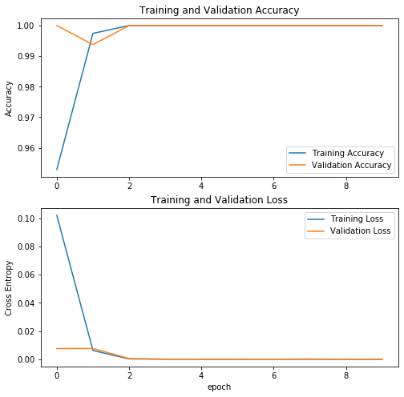

# AKOA 数据分类

## 1 数据解压并分类

首先，将下载的数据集，使用如下代码进行解压，且达到将左右膝盖分别存储在不同目录之中：

```sh
python unzip.py your_path
```

其中，`your_path` 指代你的数据集（zip 格式，不要解压）的文件路径。

## 2 模型训练与测试

在 [test.ipynb](test.ipynb) 中展示了代码的编写与可视化。[Record_training_log.ipynb](Record_training_log.ipynb) 记录了训练的日志。

## 3 可视化

训练集与测试集上的效果图：



## 4 测试集的精度与损失

模型最终在测试集的 accuracy 与损失分别为：0.9990363121032715 与 0.003378412453457713。
